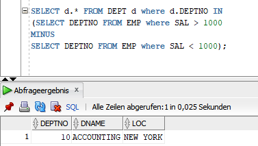

## SQL.07 - SQL Queries


### Tennis Club Queries

#### 1. Names of all players who played for both teams 1 and 2

```sql
SELECT NAME FROM PLAYERS where PLAYERNO = 
(SELECT PLAYERNO FROM MATCHES where TEAMNO = 1
INTERSECT 
SELECT PLAYERNO FROM MATCHES where TEAMNO = 2);
```


#### 2. Name and Initials of players who did not receive a penalty in the year 1980

```sql
SELECT NAME, INITIALS FROM PLAYERS where PLAYERNO NOT IN
(SELECT PLAYERNO FROM PENALTIES where to_char(PEN_DATE, 'yyyy') = '1980');
```


#### 3. Players who received at least one penalty higher than 80

```sql
SELECT * FROM PLAYERS where PLAYERNO IN (SELECT PLAYERNO FROM PENALTIES where AMOUNT > 80);
```


#### 4. Players who have only penalties with an amount higher than 80

```sql
SELECT * FROM PLAYERS where PLAYERNO =
(SELECT PLAYERNO FROM PENALTIES where AMOUNT > 80
MINUS
SELECT PLAYERNO FROM PENALTIES where AMOUNT <= 80);
```


### Employee/Department Queries

#### 1. Employees with a higher salary than the average salary of their department

```sql
SELECT * FROM EMP e where SAL > 
(SELECT AVG(SAL) FROM EMP e2 where e.DEPTNO = e2.DEPTNO GROUP BY DEPTNO);
```


#### 2. Departments with at least one employee

```sql
SELECT d.* FROM DEPT d where d.DEPTNO IN
(SELECT e.DEPTNO FROM EMP e);
```


#### 3.  Departments with at least one employee who earns more than 1000

```sql
SELECT d.* FROM DEPT d where d.DEPTNO IN
(SELECT e.DEPTNO FROM EMP e where e.SAL > 1000);
```


#### 4. Departments where all employees earn more at least 1000

```sql
SELECT d.* FROM DEPT d where d.DEPTNO IN
(SELECT DEPTNO FROM EMP where SAL > 1000
MINUS
SELECT DEPTNO FROM EMP where SAL < 1000);
```



### Ninja Queries

#### 1.

```sql
select n.code_name, count (m.mission_id) "missions" from ninja n
left outer join mission m on (n.code_name = m.code_name)
group by n.code_name;
```

The question to this query might be:

**Select the code name and the amount of missions every ninja has been on even if they've been on no mission**

#### 2.

```sql
select n.special_attack from ninja n
inner join weapon w on( n.code_name = w.code_name)
where w.dps > 12
order by n.strength desc;
```

The question to this query might be:

**Select the special attack of each ninja whose weapon deals more than 12 damage ordered by the ninjas strength descending**